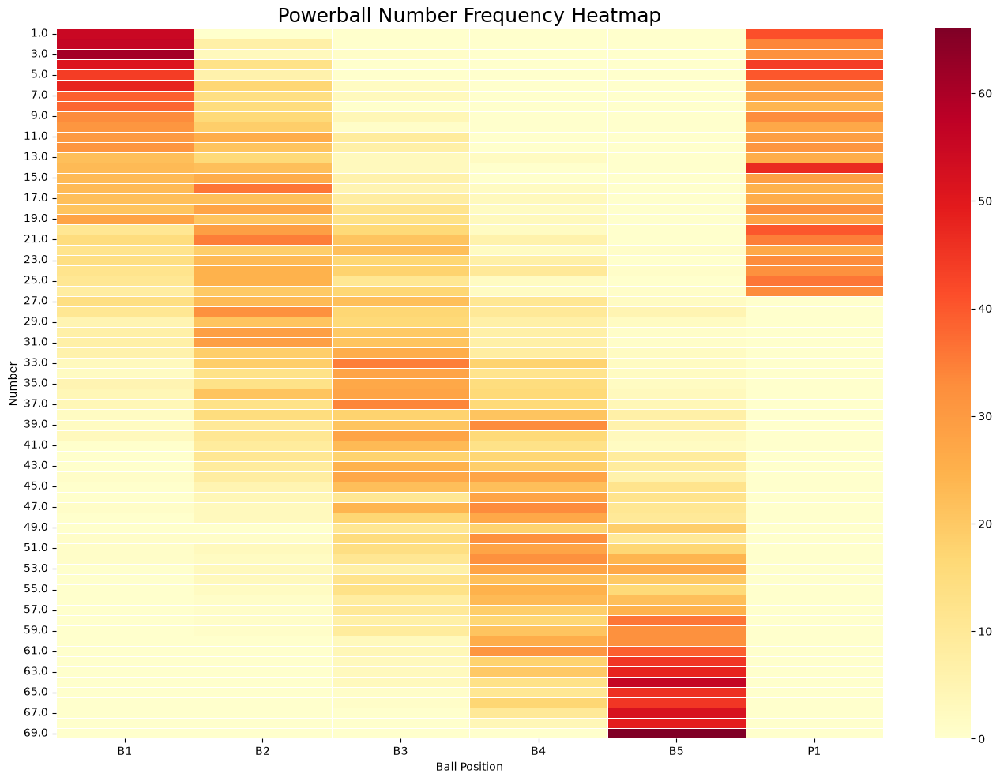
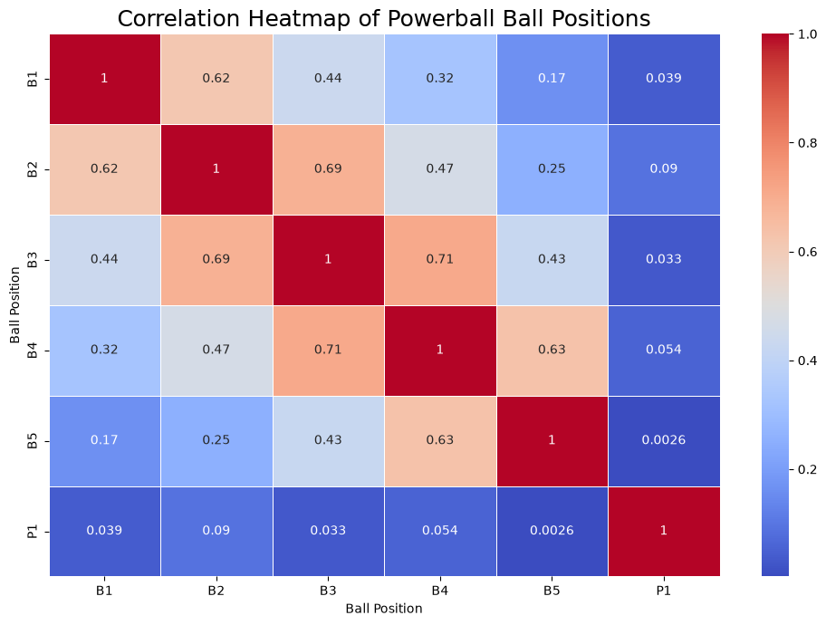

# AL-ML-- The Lottery

## Basic ML: Apply Basic Constraints, Ranges, Historical Combinations
In this project, I approach lottery prediction as a constrained, data‑driven sampling problem. I treat each ball position (B1–B5 and P1) as an independent variable with its own historical behavior. By analyzing positional ranges, frequency distributions, and statistical patterns, I create a structured framework that keeps predictions realistic, statistically grounded, and free from patterns that have already occurred.

Key Constraints:
- Position‑specific ranges  
I set realistic number ranges for each ball position to keep sampling within valid, historically consistent limits.
- Historical distribution checks  
I analyze each position’s min, max, and mean to confirm the ranges and understand how each ball typically behaves.
- Weighted frequency sampling  
I bias number selection toward historically common values instead of sampling uniformly.
- Historical combination exclusion  
I filter out any draw that has already occurred to ensure all generated combinations are new.
- Sequential pattern removal  
I reject combinations where the five white balls form a perfect sequence, since these patterns are statistically rare.
- Independent modeling per position  
Each ball position uses its own range, sampler, and distribution, treating them as independent features rather than assuming identical behavior.

## First Attempt (Apply Basic Constraints/Ranges/Historical Data)
This version analyzes historical Powerball draws, builds weighted samplers based on number frequency, and generates new combinations that avoid sequential patterns and any previously drawn results. After sampling, the white balls are sorted into ascending order.

It acts as a weighted random generator that:
- favors historically frequent numbers
- filters out unrealistic or sequential patterns
- prevents repeats of past draws

It doesn’t predict the lottery, but it produces combinations shaped by historical data rather than pure randomness.

## Second Attempt (Clustering/K-Means/Probability Modeling)
This attempt uses clustering and fitted normal distributions to generate numbers that resemble historical patterns, instead of simple random ranges or weighted frequencies.

- cleans the dataset
- clusters historical draws using K‑Means
- fits a normal distribution to each ball position
- samples new numbers from those fitted distributions
- clamps them to realistic ranges
- rejects historical repeats and sequential patterns

## Third Attempt (Machine Learning Clustering)
This version is doesn’t just generate combinations, it scores them using probability density, filters them by likelihood, and returns only the statistically strongest candidates.

- Fits normal distributions to each ball
- Generates combinations using those distributions
- Computes a joint likelihood score for each combination
- Filters out combinations with likelihood < 50%
- Removes historical repeats and sequential patterns
- Builds a DataFrame of only “high‑likelihood” combos
- Lets you search for specific combinations

This is the first version that quantifies probability and scores each generated draw. It evaluates how “probable” a combination is under your statistical model, with a likeihood threshold >=50%.

# HeatMap
This shows:
- Rows = numbers (1–69 for white balls, 1–26 for Powerball)
- Columns = ball positions (B1–B5, P1)
- Color intensity = how often that number appeared historically
You’ll instantly see:
- hot zones (frequent numbers)
- cold zones (rare numbers)
- positional biases (e.g., B1 tends to be lower numbers)

I also added a correlation heatmap to show how strongly different variables (B1, B2, B3, B4, B5, and P1) move together.

It answers a simple question: Do certain ball positions tend to rise or fall together?

The heatmap shows strong correlation among the white balls (B1–B5) and almost no correlation between the white balls and the Powerball (P1).

This confirms that:
- white balls behave similarly because they are sorted and share overlapping ranges
- The Powerball (P1) behaves independently and must be modeled separately
- A hybrid model should treat white balls as a group and P1 as its own distribution

This is exactly what we expected. 

## Results/Findings
- Situation:  
I set out to evaluate whether historical Powerball data contained usable patterns that could support more structured, statistically grounded number generation.
- Task:  
Build and test multiple modeling approaches — from basic constraints to probability‑based sampling — and assess whether they produce more realistic, data‑aligned combinations.
- Action:  
I applied positional ranges, historical frequency weighting, clustering, normal‑distribution modeling, likelihood scoring, and pattern‑filtering. I also visualized the dataset using frequency and correlation heatmaps to validate structural relationships between ball positions.
- Result:  
The models consistently produced combinations that align with historical distributions while avoiding unrealistic patterns and past draws. Heatmaps confirmed strong correlation among white balls and independence of the Powerball, supporting a hybrid modeling approach. Overall, the project demonstrates that while lottery outcomes remain random, statistical constraints can generate combinations that better reflect historical behavior.